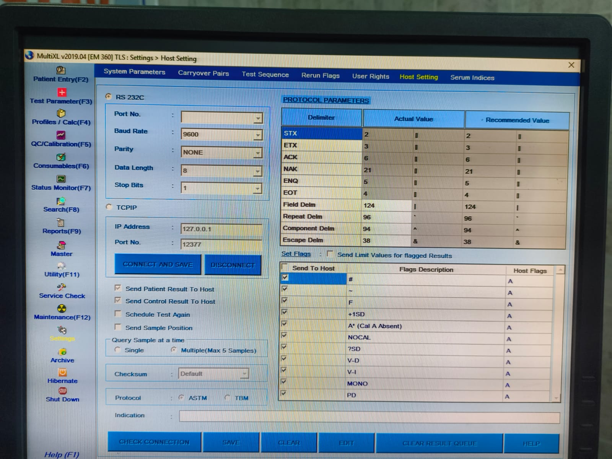

# LabReportAPI - TCP Listener + Web API for Lab Data Logging

**LabReportAPI** is a .NET 9 WebAPI application that listens for lab machine data over TCP using a custom STX/ETX protocol. Valid lab data is parsed and saved to a USB drive as a JSON file. The Web API provides endpoints to monitor status and trigger data saving.

---

## 🧠 How the Code Works

### ✅ TCP Listener (`TcpListenerService`)
- Listens on `0.0.0.0:12377` for incoming TCP messages.
- Each message must be wrapped in `STX` (`0x02`) and `ETX` (`0x03`) characters.
- Valid messages are in the format: `PATIENT123|GLUCOSE|120|mg/dL`
- Parsed data is stored in-memory as `LabMessage` objects. If the system has been idle (no TCP messages) for 30+ seconds, it saves data.
- Data is appended to `LabData.json` on the USB drive.
- Works even if the USB path is not explicitly configured (`auto-detects removable drives`).

### ✅ Web API Endpoints (`LabDataController`)
- `/api/labdata/status`: Shows the server IP, port, last message time, and write status.
- `/api/labdata/save`: Manually triggers a save to USB.

## 🧪 Lab Machine Configuration

For the LabReportAPI to receive data, you will need to configure your lab machine's settings to send data to the IP address where LabReportAPI is running, on port `12377`.

The image below shows an example of the kind of configuration settings you might encounter on a lab machine to set up the host and protocol parameters:



**Key settings to look for on your lab machine:**

* **IP Address/Host:** Set this to the IP address of the machine running `LabReportAPI`.
* **Port:** Set this to `12377`.
* **Protocol/Delimiter:** Ensure the machine is configured to send data with `STX` (Start of Text, `0x02`) and `ETX` (End of Text, `0x03`) delimiters. You may also need to configure other protocol parameters like `Baud Rate`, `Parity`, `Data Length`, and `Stop Bits` to match the machine's default output or a standard configuration.


---
<!-- 
## 🧪 For Testers

### 🔧 How to Run Locally (No Visual Studio Needed)

#### 1. Extract the ZIP
Unzip the contents of the `RefactoredLabReportAPI.zip` you received.

#### 2. Navigate to the Folder
Open CMD/PowerShell/Terminal in that folder.

#### 3. Run the App
```bash
LabReportAPI.exe
```

✅ It will start the TCP listener and WebAPI.

#### 4. Check the API
Open a browser and go to:
```
http://<YourLocalIP>:5000/api/labdata/status
```
> You can find your local IP in the `status` endpoint response.

#### 5. Send TCP Data
Use a tool like Netcat or a TCP client to send:
```
PATIENT123|GLUCOSE|120|mg/dL
```
On port `12377` to your IP.

---
 -->
<!-- ## 🧑‍💻 For Developers

### Project Structure
```
/Services
  - TcpListenerService.cs      // Main background service
  - MessageProcessor.cs        // TCP client handling, parsing, saving
/Models
  - LabMessage.cs              // Data model for messages
  - LabSettings.cs             // Configurable USB path
/Controllers
  - LabDataController.cs       // API endpoints
``` -->

### How to Build
You can build using the .NET CLI:
```bash
dotnet publish -c Release -r win-x64 --self-contained true
```

### Config USB Path (Optional)
Edit `appsettings.json`:
```json
{
  "LabSettings": {
    "UsbPath": "E:\"
  }
}
```

If left empty, the app will try to auto-detect the first available removable USB drive.

---

## 📩 Need Help?
If you're unsure how to send TCP messages or need help testing, please reach out to me.

---
